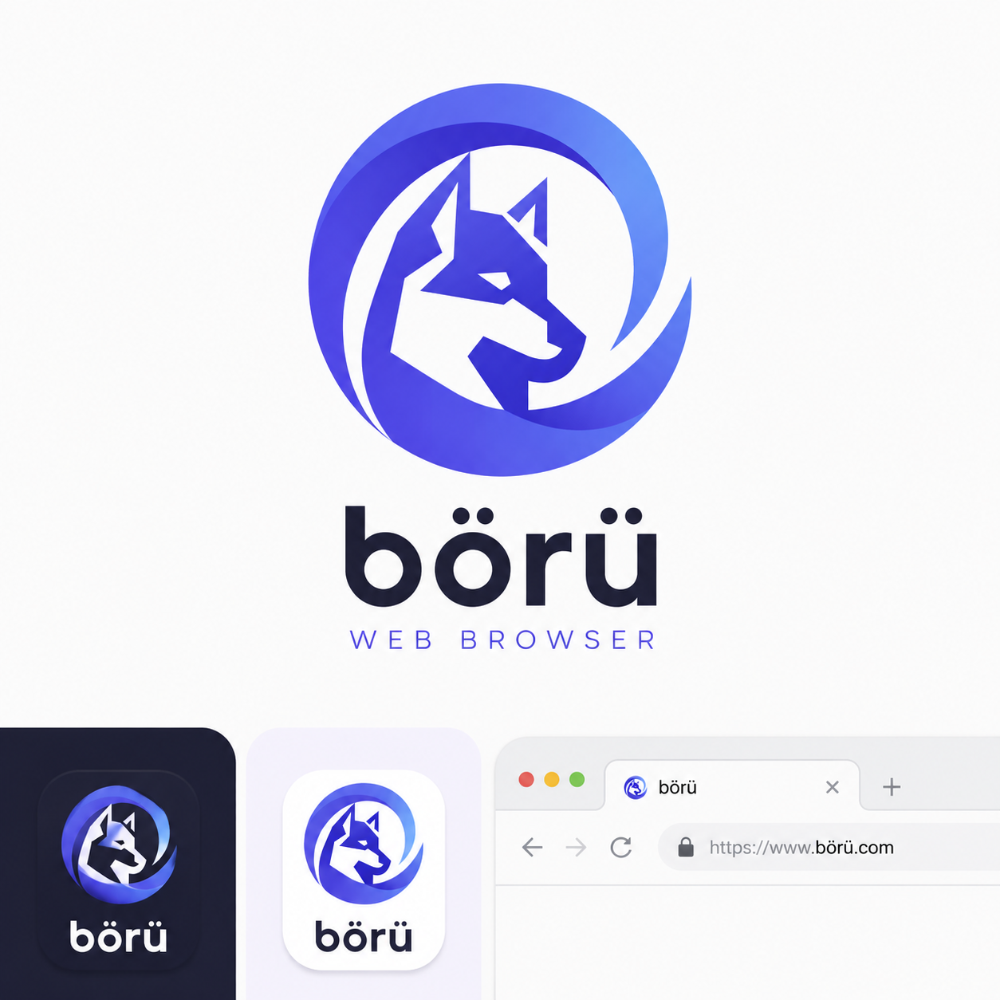

# MiniBrowser

A lightweight tabbed web browser for Windows, built with .NET 10, Avalonia UI, and WebView2.



## Features

- **Tabbed browsing** — open, switch, and close tabs (`Ctrl+T`, `Ctrl+W`, `Ctrl+Tab`)
- **Address bar with search fallback** — enter a URL or a search query
- **Find in page** — `Ctrl+F`, `F3` / `Shift+F3` for next/previous match, `Esc` to close
- **Page zoom** — `Ctrl+=`, `Ctrl+-`, `Ctrl+0` to reset
- **History** — persistent per-session navigation history backed by SQLite
- **Bookmarks** — add, remove, and quickly reopen favorite pages
- **Downloads window** — track in-flight and completed downloads (`File → Downloads`)
- **Developer Tools** — WebView2 native DevTools via `View → Developer Tools` (`F12`)
- **Favicons & HTTPS indicator** — per-tab favicon and lock icon for secure connections
- **Session restore** — reopens the last active URL on startup
- **Fullscreen** — `F11` / `View` menu
- **Settings persistence** — JSON settings with automatic recovery from corrupt files

## Requirements

- Windows 10/11 (x64)
- [.NET 10 SDK](https://dotnet.microsoft.com/download/dotnet/10.0) (for building)
- .NET 10 Runtime (for running)
- [WebView2 Runtime](https://developer.microsoft.com/microsoft-edge/webview2/) (usually preinstalled on Windows 11)

## Getting Started

Clone the repository:

```powershell
git clone https://github.com/<your-username>/mini-browser.git
Set-Location mini-browser
```

Build:

```powershell
dotnet build
```

Run:

```powershell
dotnet run --project src/MiniBrowser/MiniBrowser.csproj
```

Run tests:

```powershell
dotnet test
```

The build enforces zero warnings (`TreatWarningsAsErrors=true`).

## Project Structure

```
src/MiniBrowser/
  Views/            # Avalonia XAML windows & controls (MainWindow, Downloads, History, ...)
  ViewModels/       # MVVM view models (CommunityToolkit.Mvvm)
  Core/             # Domain abstractions (IBrowserEngine, models, settings)
  Services/         # Settings, theme, search, history, bookmarks, downloads
  Infrastructure/   # WebView2 COM interop and NativeWebViewEngine
  Assets/           # Icons and bundled resources
tests/MiniBrowser.Tests/   # Unit tests (FakeBrowserEngine / FakeSettingsService doubles)
```

### Architecture

- **UI layer** — Avalonia XAML + view models, no direct WebView2 references.
- **Core layer** — `IBrowserEngine` abstracts the rendering engine so the UI and tests depend only on the interface.
- **Services layer** — cross-cutting concerns (settings JSON persistence, history/bookmarks via SQLite, theme, search URL building).
- **Infrastructure layer** — WebView2 COM interop and the `NativeWebViewEngine` implementation (navigation, downloads, DevTools, find-in-page, zoom).

## Keyboard Shortcuts

| Action | Shortcut |
|--------|----------|
| New tab | `Ctrl+T` |
| Close tab | `Ctrl+W` |
| Next / previous tab | `Ctrl+Tab` / `Ctrl+Shift+Tab` |
| Find in page | `Ctrl+F` |
| Find next / previous | `F3` / `Shift+F3` |
| Close find bar | `Esc` |
| Zoom in / out / reset | `Ctrl+=` / `Ctrl+-` / `Ctrl+0` |
| Developer Tools | `F12` |
| Fullscreen | `F11` |
| Reload | `Ctrl+R` |

## Contributing

Contributions are welcome! Please:

1. Fork the repo and create a feature branch.
2. Keep `dotnet build` warning-free and `dotnet test` green.
3. Follow the existing Avalonia MVVM + DI patterns.
4. Open a pull request with a clear description of the change.

## License

No license has been chosen yet. If you plan to accept contributions, consider adding one (e.g. MIT) as `LICENSE`.
